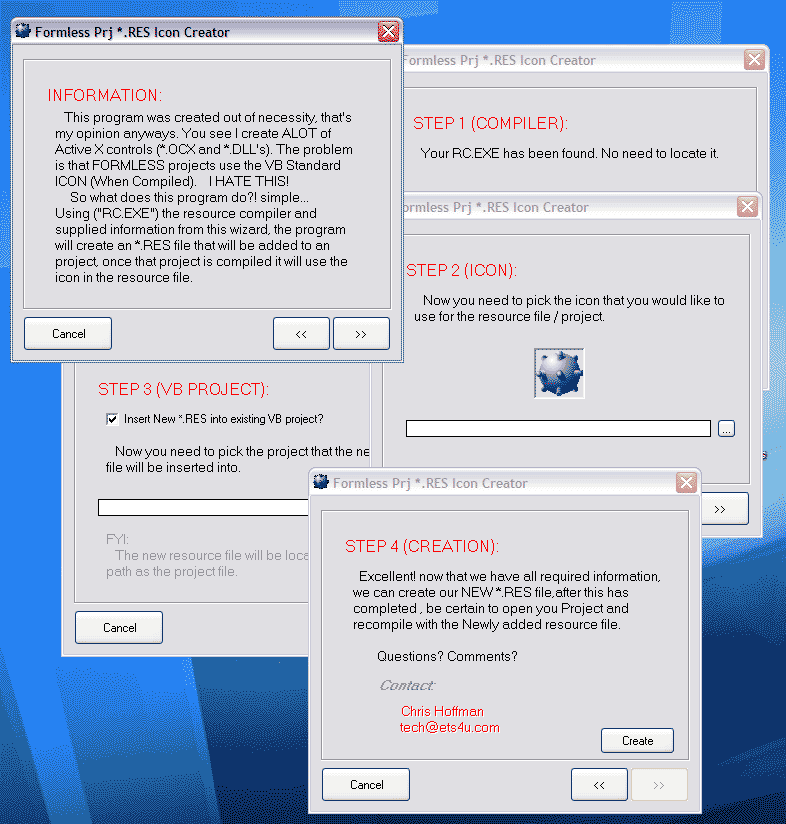



## FORMLESS PRJ Res ICON Creator

### Description

UPDATED.... Fixed a few lil glitches, and also added the ability to MAKE your new EXE without opening VB, give it a shot..............Ever notice that after you have created that aswesome EXE or any kind of FORMLESS prj, that when compiled it uses the DEFAULT VB ICON!! so you end up adding a form just to have an ICON! How LOUSY!! This app encomposes the RC.EXE file that is included with Vis Studio Enterprise edition(Although Im sure its a free D/L womewhere :O) It Creates, Inserts an RES file to your specified Prj, so that when you COMPILE the prj it will use the ICON that you choose! No more Default ICONS! This application is commented well, uses a couple of nice classes, and might teach ya few things. Please vote one way or the other?!
 
### More Info
 

             |
---                |---
**Submitted On**   |2001-11-14 17:51:54
**By**             |[Chris H](https://github.com/Planet-Source-Code/PSCIndex/blob/master/ByAuthor/chris-h.md)
**Level**          |Beginner
**User Rating**    |5.0 (10 globes from 2 users)
**Compatibility**  |VB 6\.0
**Category**       |[Complete Applications](https://github.com/Planet-Source-Code/PSCIndex/blob/master/ByCategory/complete-applications__1-27.md)
**World**          |[Visual Basic](https://github.com/Planet-Source-Code/PSCIndex/blob/master/ByWorld/visual-basic.md)
**Archive File**   |[FORMLESS\_P3544711152001\.zip](https://github.com/Planet-Source-Code/chris-h-formless-prj-res-icon-creator__1-28892/archive/master.zip)

